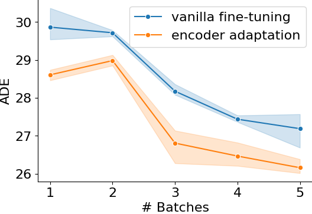

# Motion Style Transfer

This is an implementation of the paper

**Motion Style Transfer: Modular Low-Rank Adaptation for Deep Motion Forecasting**
<br>

<a href="https://thedebugger811.github.io">Parth Kothari</a>, 
<a href="https://people.epfl.ch/danya.li/?lang=en">Danya Li</a>
<a href="https://sites.google.com/view/yuejiangliu">Yuejiang Liu</a>,
<a href="https://people.epfl.ch/alexandre.alahi/?lang=en/">Alexandre Alahi</a>
<br>
École Polytechnique Fédérale de Lausanne (EPFL)

<!-- Links: **[`Arxiv 11/2021`](https://arxiv.org/abs/2111.14820) | [`Video (7 min)`](https://drive.google.com/file/d/1Uo0Y0eHq4vI7wOxya4mJlxbAe3U4kMx6/view) | [`Spurious`](https://github.com/vita-epfl/causalmotion/tree/main/spurious) | [`Style`](https://github.com/vita-epfl/causalmotion/tree/main/style)**
<br> -->
*Under Review*


<!-- 
If you find this code useful for your research, please cite our paper:

```bibtex
@article{liu2021causalmotion,
  title={Towards Robust and Adaptive Motion Forecasting: A Causal Representation Perspective},
  author={Liu, Yuejiang and Cadei, Riccardo and Schweizer, Jonas and Bahmani, Sherwin and Alahi, Alexandre},
  journal={arXiv preprint arXiv:2111.14820},
  year={2021}
}
``` -->


## Overview

We propose efficient adaptation of deep motion forecasting models pretrained in one domain with sufficient data to new styles with *limited samples* through the following designs: 

* a low-rank motion style adapter, which projects and adapts 10 the style features at a low-dimensional bottleneck

* a modular adapter strategy, which disentangles the features of scene context and motion history to facilitate a fine-grained choice of adaptation layers

<p align="center">
  
</p>


## Setup

Use `python=3.8`.

Install PyTorch, for example using pip

```
pip install --upgrade pip
pip install torch==1.9.0+cu111 torchvision==0.10.0+cu111 torchaudio==0.9.0 -f https://download.pytorch.org/whl/torch_stable.html
```

Install dependencies
```
pip install -r requirements.txt
```

Build [ddf dependency](https://github.com/theFoxofSky/ddfnet)
```
cd ddf
python setup.py install
mv build/lib*/* .
```


## Dataset

<!-- Get the raw dataset, our filtered custom dataset and segmentation masks for SDD from the original Y-net authors
```
pip install gdown && gdown https://drive.google.com/uc?id=14Jn8HsI-MjNIwepksgW4b5QoRcQe97Lg 

pip install gdown && gdown https://drive.google.com/file/d/1BZQ6ApSTG8-nOPiX5jvN4FH7zf916uM_/view?usp=sharing
unzip sdd_ynet.zip
``` -->

Our filtered datasets and segmentation masks can be downloaded from [here](https://drive.google.com/file/d/1BZQ6ApSTG8-nOPiX5jvN4FH7zf916uM_/view?usp=sharing). Due to copyright, we cannot provide data for inD dataset. Please request the inD file from the authors and then use the `utils.processing_inD.py` file for preprocessing. The data directory should have the following structure:
```
data
├── sdd
│   ├── raw/annotations/
│   ├── filter
│   |    ├── avg_vel/
│   |    └── agent_type/
│   └── sdd_segmentation.pth 
|
└── inD-dataset-v1.0
    ├── images/
    ├── data/
    ├── filter/agent_type/
    └── inD_segmentation.pth 

```

In addition to our provided datasets, you can create customized ones: 
```
bash scripts/customize_dataset.sh
```


## Experiments 

There are six sets of experiments provided in our paper:

| Experiment | Dataset used | Model used | Prediction | Pretraining | Adaptation |
|----------|--------|----------|--------|----------|--------|
| Motion Style Transfer across Agents | SDD | Y-Net | short-term | pedestrians (all scenes) | bikers (deathCircle_0) |
| Motion Style Transfer across Scenes | inD | Y-Net | long-term | pedestrians (scenes=2,3,4) | pedestrians (scenes=1) | 
| Motion Style Transfer across Scenes | L5 | ViT-Tiny | open-loop | vehicles (upper city) | vehicles (lower city) |
| Modular Style Adapter (Agent motion) | inD | Y-Net-Mod | long-term |cars (scenes=1) | trucks (scenes=1) | 
| Modular Style Adapter (Scene) | inD | Y-Net-Mod | short-term | pedestrians (scenes=2,3,4) | pedestrians (scenes=1) |
| Modular Style Adapter (Agent motion) | SDD | Y-Net-Mod | shot-term | bikers (low speed) | bikers (high speed)

The above experiments correpond to scripts as follows:

| Experiment | Script folder | 
|------------|---------------|
| Motion Style Transfer across Agents | `scripts/sdd/ped_to_biker/` | 
| Motion Style Transfer across Scenes | `scripts/inD/ped_to_ped/ynet/` | 
| Modular Style Adapter (Agent motion) | `scripts/inD/scene1_car_to_truck/` | 
| Modular Style Adapter (Scene)1 | `scripts/inD/ped_to_ped/ynetmod/` | 
| Modular Style Adapter (Agent motion) | `scripts/sdd/biker_low_to_high/` |

In each folder, scripts for pretraininng, generalizing, baseline fine-tuning, and MoSA fine-tuning are provided. Please check out L5 experiment in [this repository](link). 

Our pretrained models can be downloaded from [here](https://drive.google.com/file/d/12Za6XlInUPzk5__Xwj_k14lw2dBaVqMn/view?usp=sharing) and should be placed under `ckpts/`. 


<!-- &nbsp;&nbsp;&nbsp;&nbsp;Our pretrained models can be downloaded from [google drive](https://drive.google.com/drive/folders/1HzHP2_Mg2bAlDV3bQERoGQU3PvijKQmU).
```
cd ckpts
gdown https://drive.google.com/uc?id=180sMpRiGhZOyCaGMMakZPXsTS7Affhuf
``` -->

<!-- ### Basic Results

Results of different methods for low-shot transfer across agent types and speed limits.

 -->


## Acknowledgement

Our code is developed upon the public code of [Y-net](https://github.com/HarshayuGirase/Human-Path-Prediction/tree/master/ynet) and [Decoupled Dynamic Filter](https://github.com/theFoxofSky/ddfnet).
